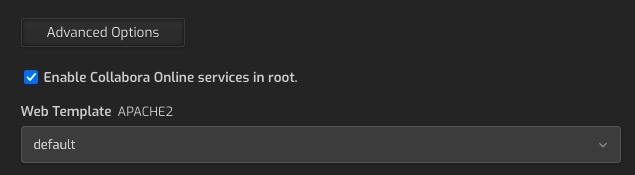

# hcpp-collabora
A plugin for Hestia Control Panel (via hestiacp-pluginable) that installs a Collabora Online instance. 


&nbsp;
 > :warning: !!! Note: this repo is in progress; when completed, a release will appear in the release tab.
 
&nbsp;
## Installation
HCPP-Collabora requires an Ubuntu or Debian based installation of [Hestia Control Panel](https://hestiacp.com) in addition to an installation of [HestiaCP-Pluginable](https://github.com/virtuosoft-dev/hestiacp-pluginable) to function; please ensure that you have first installed pluginable on your Hestia Control Panel before proceeding. Switch to a root user and simply clone this project to the /usr/local/hestia/plugins folder. It should appear as a subfolder with the name `collabora`, i.e. `/usr/local/hestia/plugins/collabora`.

First, switch to root user:
```
sudo -s
```

Then simply clone the repo to your plugins folder, with the name `collabora`:

```
cd /usr/local/hestia/plugins
git clone https://github.com/virtuosoft-dev/hcpp-collabora
collabora
```

Note: It is important that the destination plugin folder name is `collabora`.


Be sure to logout and login again to your Hestia Control Panel as the admin user or, as admin, visit Server (gear icon) -> Configure -> Plugins -> Save; the plugin will immediately start installing Collabora depedencies in the background. 

A notification will appear under the admin user account indicating *”WebDWAV plugin has finished installing”* when complete. This may take awhile before the options appear in Hestia. You can force manual installation via:

```
cd /usr/local/hestia/plugins/collabora
./install
touch "/usr/local/hestia/data/hcpp/installed/collabora"
```

&nbsp;
## Using Collabora
This plugin will create a `Enable Collabora Server in subfolder` checkbox in the **Advanced Options** section of the web edit page for a given domain. This will all your website to access Collabora services via the URL with the given subfolder; i.e. for domain `test4.dev.cc`, at URL `https://test4.dev.cc/coolwsd`.

<br><br>
<sub>Figure 1 - The Enable Collabora option under the Advanced Options button</sub>

<br>

## Support the creator
You can help this author’s open source development endeavors by donating any amount to Stephen J. Carnam @ Virtuosoft. Your donation, no matter how large or small helps pay for essential time and resources to create MIT and GPL licensed projects that you and the world can benefit from. Click the link below to donate today :)
<div>
         

[<kbd> <br> Donate to this Project <br> </kbd>][KBD]


</div>


<!-------------------------->

[KBD]: https://virtuosoft.com/donate

https://virtuosoft.com/donate
